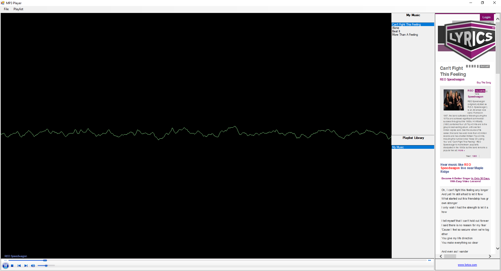

# MP3 Player

## Table of contents
* [Introduction](#introduction)
* [Screenshots](#screenshots)
* [Technologies](#technologies)
* [Status](#status)

## Introduction
This project is an MP3 player that allows the creation, deletion and playing of Windows playlist. With the added feature of displaying the lyrics of the song currently being played provided that the song lyrics are contained in the www.lyrics.com catalogue.

## Screenshots

### Player in Action

## Technologies
C#, WMPLib, AXWMPLib, JSON, REST API  

## Status
Error checking required